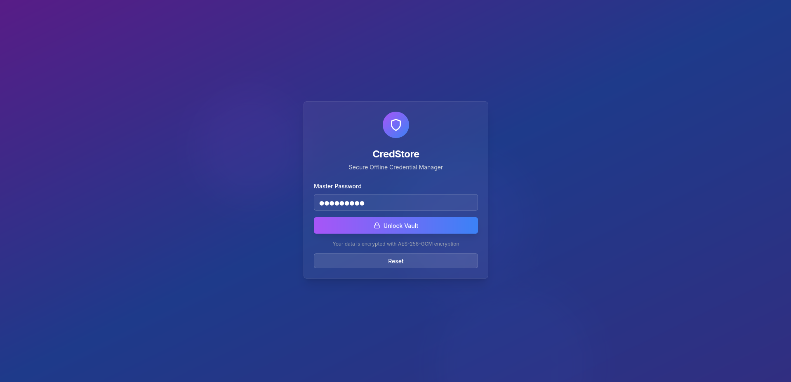
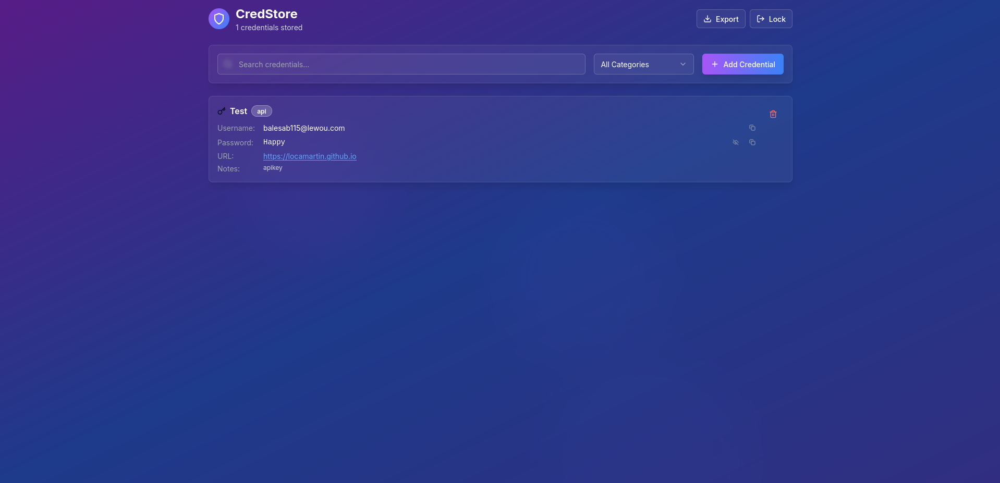

<!--
<div align="center">
  <svg xmlns="http://www.w3.org/2000/svg" width="100" height="100" viewBox="0 0 24 24" stroke-width="4" stroke-linecap="round" stroke-linejoin="round">
    <defs>
      <linearGradient id="shieldGradient" x1="0%" y1="0%" x2="100%" y2="100%">
        <stop offset="0%" style="stop-color:#FF0000; stop-opacity:1" /> <stop offset="100%" style="stop-color:#0000FF; stop-opacity:1" /> </linearGradient>
    </defs>
    <path d="M12 22s8-4 8-10V5l-8-3-8 3v7c0 6 8 10 8 10" fill="none" stroke="url(#shieldGradient)" />
  </svg>
</div>
-->

<div align="center">
  
  <br> 
</div>

<p align="center"><b>1.0.0</b></p>

### Is a offline personal cross-platform credential management app made with

[](https://opensource.org/licenses/MIT)
[](https://www.typescriptlang.org/)
[](https://nextjs.org/)
[](https://www.electronjs.org/)
[](https://en.wikipedia.org/wiki/Galois/Counter_Mode)
[](https://reactjs.org/)
[](https://tailwindcss.com/)
[](https://www.radix-ui.com/)
[](https://lucide.dev/)
[](https://cva.style/)
[](https://www.electron.build/)
[](https://capacitorjs.com/)
[](https://developer.android.com/)
[](https://developer.mozilla.org/en-US/docs/Web/API/Web_Crypto_API)

### To store passwords, API keys, and sensitive data in an organized manner .




### You can download precompiled binaries from [here](https://github.com/LocaMartin/credstore/releases)

## ✨ Features

### Security First
- **AES-256-GCM Encryption**: for all stored data
- **PBKDF2 Key Derivation**: 50,000 iterations with SHA-256 for password strengthening
- **Zero Network Communication**: Completely offline operation
- **Memory-Only Master Key**: Master password never written to disk
- **Auto-Lock Protection**: Automatically locks when tab becomes inactive
- **Secure Random Generation**: Cryptographically secure password generation

### Credential Management
- **Multiple Categories**: Organize credentials by Website, API Key, Database, or Custom
- **Rich Metadata**: Store titles, usernames, passwords, URLs, and notes
- **Advanced Search**: Real-time search across all credential fields
- **Category Filtering**: Quick filtering by credential type
- **Secure Copy**: One-click copying to clipboard with automatic clearing
- **Export Functionality**: Secure backup export in JSON format

## Security Architecture
- ✅ Master password never stored on disk
- ✅ All data encrypted with AES-256-GCM
- ✅ Unique salt per encryption operation
- ✅ No network communication
- ✅ Memory cleared on app close/lock
- ✅ Auto-lock on inactivity

## Software and System Requirements

<div style="display: flex; flex-wrap: wrap; justify-content: space-between;">

  <div style="flex: 1 1 48%; margin-right: 1%;">
    <h3>Prerequisites</h3>
    <ul>
      <li><b>Node.js</b>: Version 18.0 or higher.</li>
      <li><b>npm</b>: package manager.</li>
      <li><b>Git</b>: For version control.</li>
    </ul>
  </div>

  <div style="flex: 1 1 48%; margin-left: 1%;">
    <h3>System Requirements</h3>
    <ul>
       <li><b>Web</b>: Modern browser with Web Crypto API support.</li>
       <li><b>Desktop</b>: Windows 10+, macOS 10.14+, or Linux with GTK 3.0+.</li>
       <li><b>Mobile</b>: Android 7.0+ (API level 24+).</li>
       <li><b>Storage</b>: Minimum 100MB free space.</li>
    </ul>
  </div>

</div>

## Manual compilation

#### Clone the repository
```bash
git clone https://github.com/LocaMartin/credstore.git
```
#### Web Version
```bash
# Build and run the web version

# Install dependencies
npm install

# Production Build
npm run build

# Production Start
npm run start
```
#### Build for current platform
```bash
npm run dist
```
#### Desktop Version (Electron)
```bash
# Run in development mode
npm run electron-dev

# Build for your current platform
npm run dist

# Build for specific platforms
npm run dist-linux
npm run dist-windows
npm run dist-mac
# Build for all platforms
npm run dist-all
```
#### Android Version
```bash
# Initialize Android project
npm run android:init

# Sync changes to Android project
npm run android:sync

# Open in Android Studio
npm run android:open

# Build APK With "npm"
npm run android:build

# Build APK
cd android
./gradlew assembleDebug

# The APK will be available at:
# ~/credstore/android/app/build/outputs/apk/debug/app-debug.apk

# Run on device/emulator
npm run android:run
```
### Encryption Process
1. **Master Password Input**: User enters master password
2. **Salt Generation**: Cryptographically secure random salt created
3. **Key Derivation**: PBKDF2 with 50,000 iterations generates encryption key
4. **Data Encryption**: AES-256-GCM encrypts credential data
5. **Secure Storage**: Encrypted data stored locally with salt and IV
   
>[!WARNING]
<h2>INCASE YOU FORGOT YOUR PASSWORD/MASTER KEY</h2>

**There is no way to recover your data if you forget your master password.** 
> The encryption is designed to be unbreakable, which means:
- No password recovery mechanism exists
- No backdoors or master keys
- Data is permanently inaccessible without the correct password
- But you can `RESET` the app to use it . ( complete new star all your credentials will be permanently erased ) here are some 

### Option 1: Try to Remember (Most Common)

### Option 2: Reset and Start Fresh
- There is a `RESET` button on the login page click and proceed !
### Option 3: Manual Reset via Browser

- Open browser developer tools (F12)
- Go to Application/Storage tab
- Find localStorage
- Delete the "credstore_data" entry
- Refresh the page

### Option 4: 
If you're still having issues with the component, you can also reset directly from the browser console:

1. Open your browser's developer tools (F12 or right-click → Inspect)
2. Go to the Console tab
3. Run this command:

```javascript
localStorage.removeItem("credstore_data");
location.reload();
```
This will immediately clear all stored data and refresh the page, allowing you to create a new master password.

## PREVENTION

- Write It Down Your **MASTER KEY/PASSWORD** Securely
- Use a Memorable Pattern

### Upcoming Features

- [ ] Team sharing capabilities
  -  With QR code (wifi/bluetooth)
- [ ] Browser extension

### Performance Improvements
- [ ] Web Workers for encryption
- [ ] Virtual scrolling for large datasets
- [ ] Offline-first PWA enhancements
- [ ] Memory usage optimization

Contributing
1. Fork the repository
2. Create a feature branch (`git checkout -b feature/amazing-feature`)
3. Commit your changes (`git commit -m 'Add amazing feature'`)
4. Push to the branch (`git push origin feature/amazing-feature`)
5. Open a Pull Request

<div align="center">
<table>
  <tr>
    <td><a href="DOC4DEV.md">DOCUMENTATION FOR DEVELOPERS</a></td>
  </tr>
</table>
</div>
